# My Finance Tracker

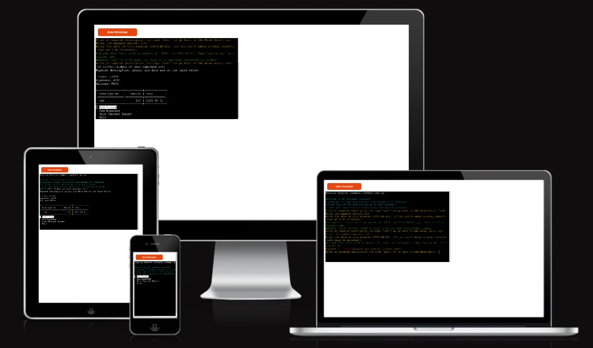

*The link to [My Finance Tracker](https://my-finance-tracker-5dbb3b20f56d.herokuapp.com/)*

My Finance Tracker is a Python terminal project whose primary purpose is to keep record of
one&#39;s income and expenses.

This is a personal finance tracker that allows users to add income and expenses, manage a
budget, and store the data in a Google Spreadsheet for persistence across sessions. It
includes input validation for date format, income and expense amounts, and description
fields to ensure data accuracy.

By storing financial records in the cloud, users can access and track their budget from
anywhere. The program offers a user-friendly interface with options to add income, record
expenses, view the current budget, and exit.

This tool is beneficial for organizing finances, promoting better money management, and
simplifying expense tracking with real-time budget updates.

---
## User Stories
### First Time Visitor Goals:

* As a new user, I want to add my income with a specific date, so I can keep track of when I
received money.
* As a new user, I want to record my daily expenses with descriptions and amounts, so I can
see how I’m spending my money.
* As a new user, I want to view my total income and expenses, so I can quickly understand
how much I’m saving or overspending.

### Frequent Visitor Goals:
* As a returning user, I want to view my previous income and expenses saved in Google
Sheets, so I can continue tracking my budget from where I left off.

* As a returning user, I want to add multiple expenses efficiently without needing to restart the
program, so I can easily update my spending.
* As a returning user, I want to check my current budget regularly to compare my income with
my total expenses and stay financially organized.

---

## Instructions and Program Features

- **When the program is loaded:**

- Welcome Message: When the program is loaded, it greets the user with a welcome
message.
- Menu Display: The user is presented with a menu offering four options: Add Income, Add
Expenses, Show Current Budget, and Exit.

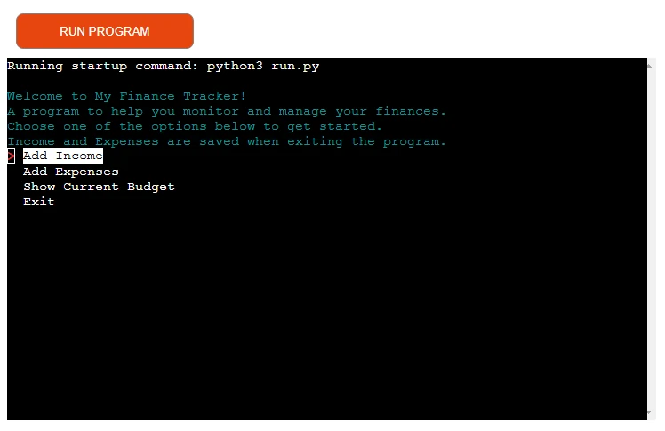

- **When User Chooses &quot;Add Income&quot;:**

- The program prompts the user to enter their income amount.
- The user is then asked to enter the date of the income (with validation to ensure the
format is YYYY-MM-DD).
- The program confirms the income has been added and saves the entry to Google Sheets.

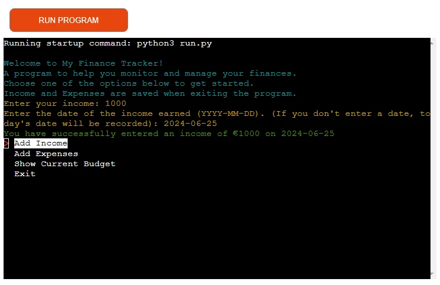

The user can manipulate the terminal menu with the arrow keys to choose an option and
the enter key to confirm the choice.

- **When User Chooses &quot;Add Expenses&quot;:**

- The program enters a loop, prompting the user to input multiple expenses.
- For each expense, the user enters a description, amount, and date (with validations).
- The program asks for confirmation of the expense details before adding it.
- This process repeats until the user types &quot;exit&quot; to stop adding expenses.

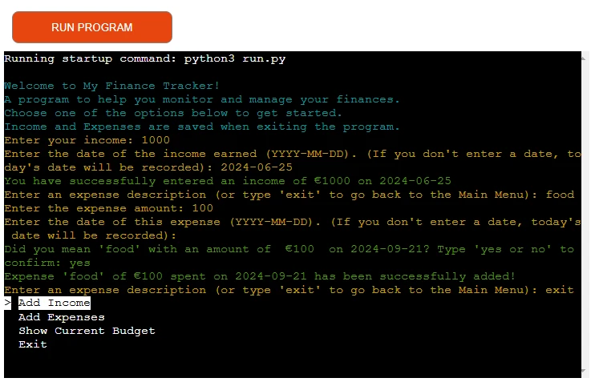

- **When User Chooses &quot;Show Current Budget&quot;:**

- The program calculates and displays the total income, total expenses, and the remaining
savings (income minus expenses).
- It shows a table of all recorded expenses, including their descriptions, amounts, and
dates.

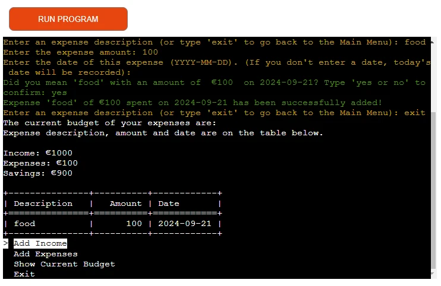

- **When User Chooses &quot;Exit&quot;:**

- The program saves the current income and expenses to the Google Spreadsheet.
- It displays a goodbye message and exits the program gracefully.

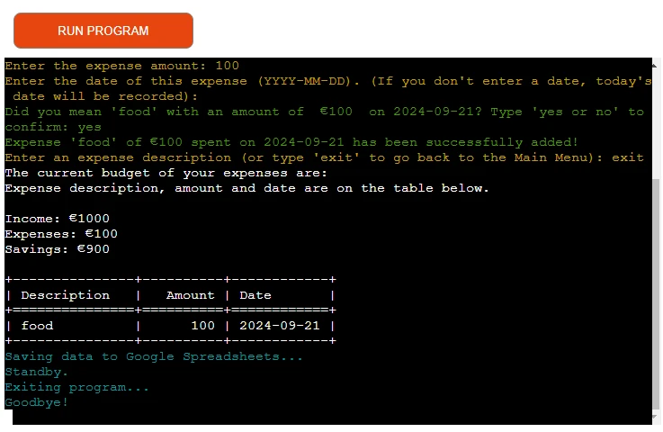

- **Future Features:**

- User Login and Authentication.
- Monthly Budget Goals.
- Expense Categories and Reporting.
- Recurring Income and Expenses.
- Have ability to choose currency from multiple options.

---

## Flowchart

The flowchart represents the logic of the application:

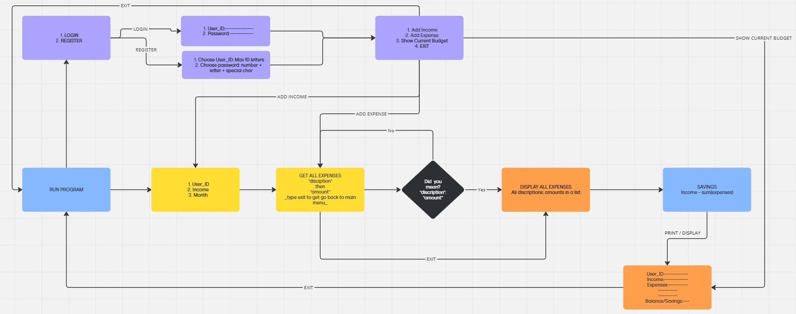

---
## Technologies Used

### Languages:

- [Python 3.8.5](https://www.python.org/downloads/release/python-385/): used to anchor the
project and direct all application behavior
- [JavaScript](https://www.javascript.com/): used to provide the start script needed to run the
Code Institute mock terminal in the browser
- [HTML](https://developer.mozilla.org/en-US/docs/Web/HTML) used to construct the
elements involved in building the mock terminal in the browser

### Frameworks/Libraries, Programmes and Tools:
#### Python modules/packages:

##### Standard library imports:

- [DateTime](https://pypi.org/project/DateTime/) - Part of the Python standard library for manipulating dates and times.

##### Third-party imports:

- [colorama](https://pypi.org/project/colorama/) A third-party library that provides cross-platform colored terminal text.
- [tabulate](https://pypi.org/project/tabulate/) A third-party library for printing tabular data in a readable format.
- [simple_term_menu](https://pypi.org/project/simple-term-menu/) A third-party library for creating interactive terminal menus.

#### Other tools:

- [Git](https://git-scm.com/) was used for the version control of the website.
- [GitHub](https://github.com/) was used to host the code of the website.
- [GIMP](https://www.gimp.org/) was used to make and resize images for the README file.
- [gitpod](https://www.gitpod.io/) was used as the main tool to write and edit code.
- [miro](https://miro.com/app/board/uXjVKg3MIpg=/) was used to make a flowchart for the README file.
- [formatter.org](https://formatter.org/python-formatter) was used to align code indentation.

---

## Bugs

 **Solved bugs**

  1. The code would break (UnboundLocalError) everytime when the program is first run and "Show Budget" or "Exit" are selected without income being selected.

  _Solution_: I ensured income always has a value even at the beggining of the program (0), If no income is added, income_date should keep its previous value (if it exists).

  2. The income variable was getting assigned as a tuple rather than a float when returning both income and income_date from the add_income function,displaying the error, TypeError: unsupported operand type(s) for -: 'tuple' and 'float'"

  _Solution_: When calling the add_income function, I assigned income separately from income_date ensuring that only income (a floating number) is used for calculations.
  ```
if choice == 0:
    income, income_date = add_income()  # Returning both income and date
  ```

 **Unsolved bugs**
- All noticed bugs were fixed.
- Please report any bugs you might see to TafadzwaMangena

---
## Testing

- The code was tested using [CI Python Linter](https://pep8ci.herokuapp.com/) provided by [Code Institute](https://codeinstitute.net/global/)
- I also manually tested the code confirming all functions work as intended and the google spreadsheet is updated accordingly.

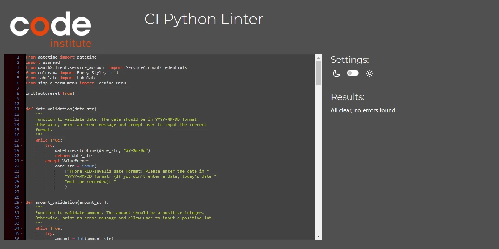

---
## Deployment
- The program was deployed to [Heroku](https://dashboard.heroku.com).
- The program can be reached by the [link](https://my-finance-tracker-5dbb3b20f56d.herokuapp.com/)

### To deploy the project as an application that can be **run locally**:

*Note:*
1. This project requires you to have Python installed on your local PC:
- `sudo apt install python3`
2. You will also need pip installed to allow the installation of modules the application uses.
- `sudo apt install python3-pip`
Create a local copy of the GitHub repository by following one of the two processes below:
- Download ZIP file:
3. Go to the [GitHub Repo page](https://github.com/TafadzwaMangena/my-finance-tracker).
4. Click the Code button and download the ZIP file containing the project.
5. Extract the ZIP file to a location on your PC.
- Clone the repository:
6. Open a folder on your computer with the terminal.
7. Run the following command
- `git clone https://github.com/TafadzwaMangena/my-finance-tracker.git`
- Alternatively, if using Gitpod, you can click below to create your own workspace using this
repository.
8. Install Python module dependencies:
9. Navigate to the folder madlib_with_python by executing the command:
- `cd my_finance_tracker`
10. Run the command pip install -r requirements.txt
- `pip3 install -r requirements.txt`

### To deploy the project to Heroku so it can be run as a remote web application:
- Clone the repository:
1. Open a folder on your computer with the terminal.
2. Run the following command
- `git clone https://github.com/TafadzwaMangena/my-finance-tracker.git`
3. Create your own GitHub repository to host the code.
4. Run the command `git remote set-url origin &lt;Your GitHub Repo Path&gt;` to set the remote repository location to your repository.
5. Push the files to your repository with the following command:
`git push`
6. Create a Heroku account if you don&#39;t already have one here [Heroku](https://dashboard.heroku.com).
7. Create a new Heroku application on the following page here [New HerokuApp](https://dashboard.heroku.com/apps):
8. Go to the Deploy tab:
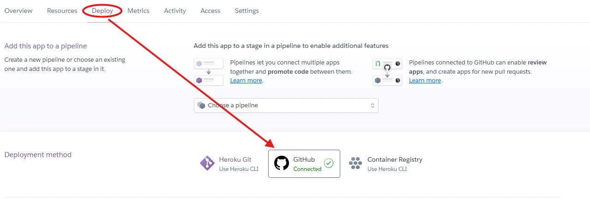
9. Link your GitHub account and connect the application to the repository you created.
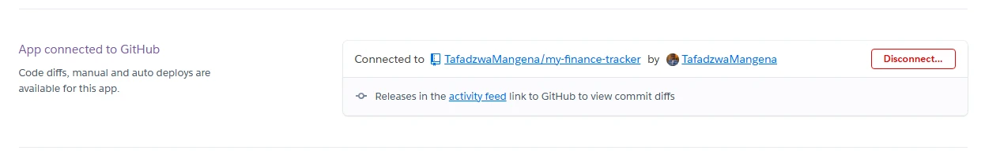
10. Go to the Settings tab:
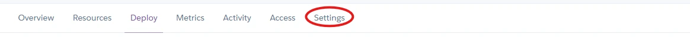
11. Click &quot;Add buildpack&quot;:
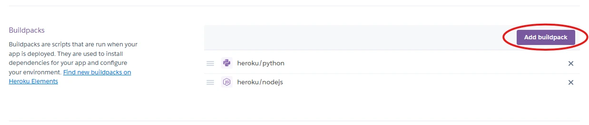
12. Add the Python and Node.js buildpacks in the following order:
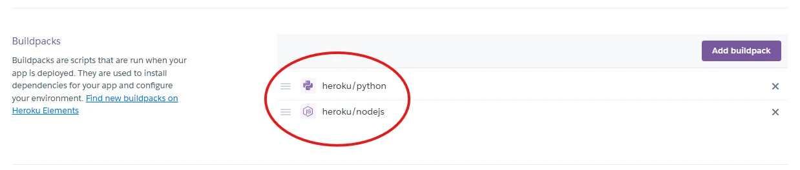
13. Click &quot;Reveal Config Vars.&quot;
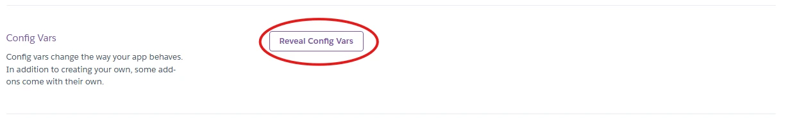
14. Add 1 new Config Vars:
- Key: CREDS
- VALUE: Copy and Paste your creds.json file
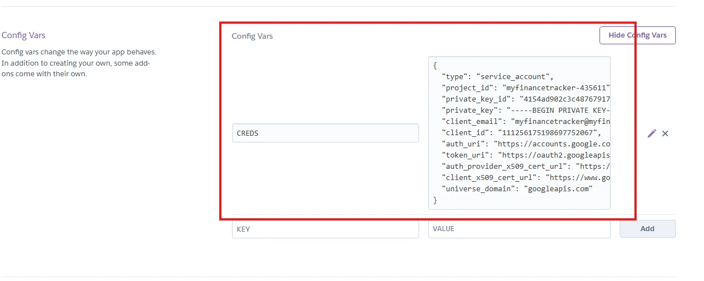
15. Go back to the Deploy tab:
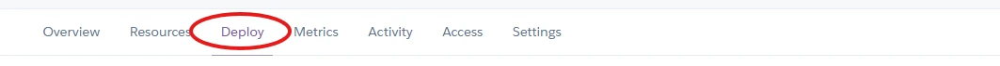
16. Click &quot;Deploy Branch&quot;:
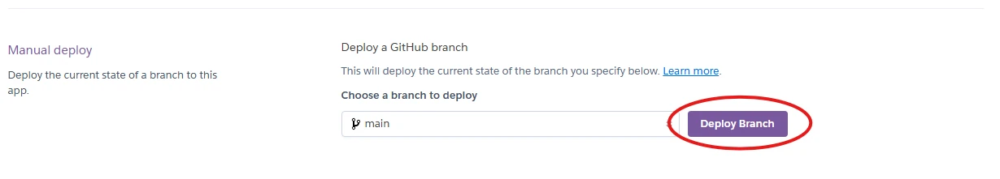
17. Wait for the completion of the deployment.
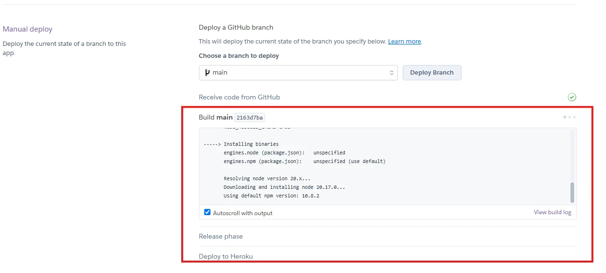
18. Click &quot;Open app&quot; to launch the application inside a web page.
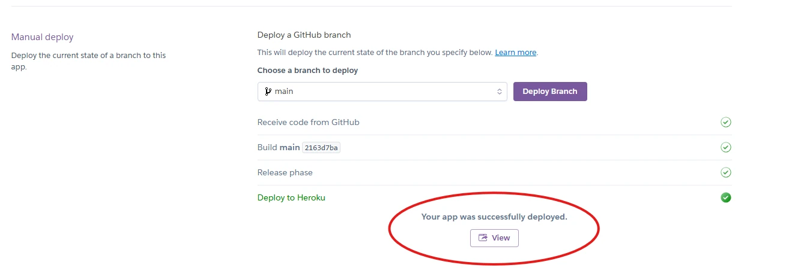

---

## Credits

- Color formatting: [Colorama](https://pypi.org/project/colorama/).
- Terminal menu: [Simple Terminal Menu](https://pypi.org/project/simple-term-menu/).

- ### Code Credits

- The add_expense function was inspired by Tiff from [Tiff In Tech](https://www.youtube.com/@TiffInTech) youtube channel.
- [Internet Made Coder](https://www.youtube.com/@InternetMadeCoder): I used one of the ideas from this youtube channel to make the flowchat and structure of my code.
- Syntax errors and other errors where solved using some of the articles and responses from [stackoverflow](https://stackoverflow.com/)
- [Code Institue](https://learn.codeinstitute.net/dashboard): tutorials  were used to wire up APIs an connect to google spread sheets.
- [Code Institue](https://learn.codeinstitute.net/dashboard): tutorials  were used to format code to maintain 79 charatcers or less on one line.
- This project was ceated using a full template provided by [Code 
Institute](https://github.com/Code-Institute-Org/ci-full-template).

---
## Acknowledgements
- My wife was supportive though out the building of the website and gave me ideas.
- My Mentor has been a great help giving insightful feedback.
- Tutor support at Code Institute.
- Slack community at Code Institute.
